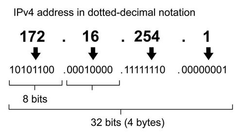
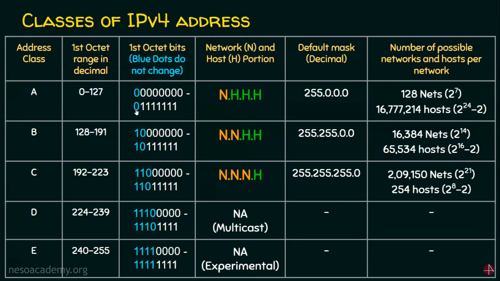
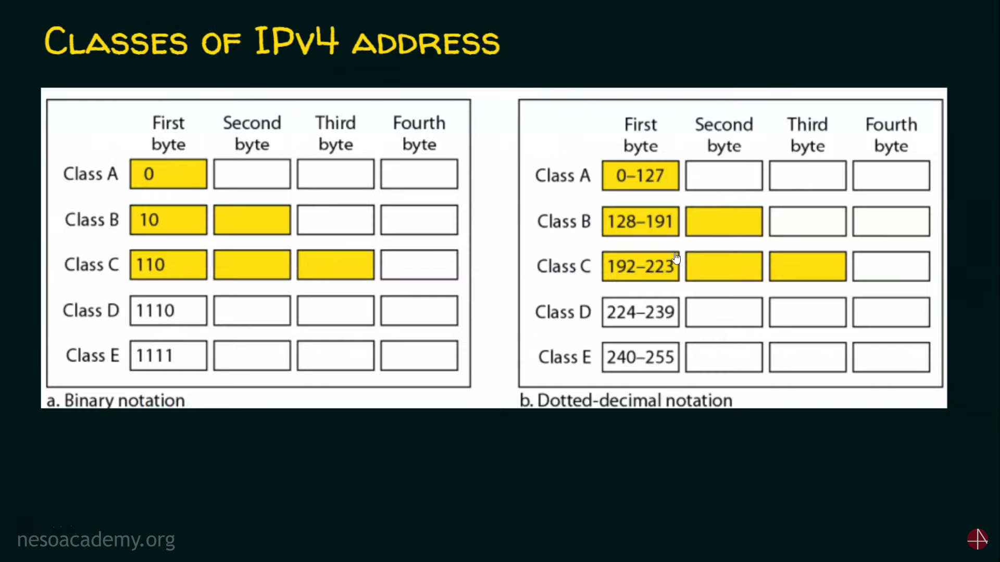
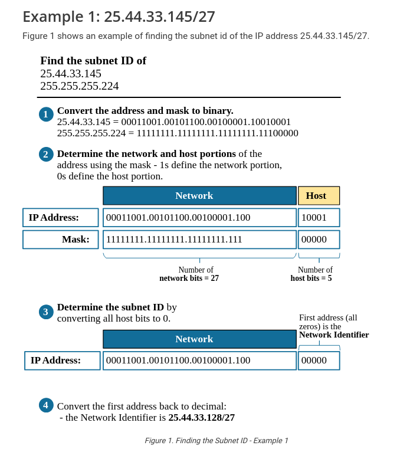
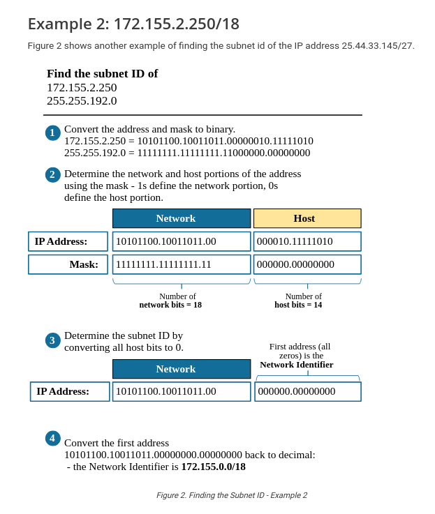

# What is a network?

- A `network` is nothing more than two or more computers connected to each other so that they can exchange information, such as e-mail messages or documents, or share resources, such as disk storage or printers. In most cases, this connection is made via electrical cables that carry the information in the form of electrical signals. But in some cases, other types of connections are used. For example, fiber-optic cables let computers communicate at extremely high speeds by using impulses of light. Wireless networks let computers communicate by using radio signals, so the computers aren’t restricted by physical cables.

## IP address

- An IP (Internet Protocol) address is a unique numerical label assigned to each device connected to a computer network that uses the Internet Protocol for communication. It serves two main functions:

- An IPv4 address is 32 bits long.
- The address space of IPv4 is $2^{32}$ or 4,294,967,296 (more than 4 billion).

1. **Identification**: It identifies a device on a network. Each device has a unique IP address within the network, allowing it to be distinguished from other devices.

2. **Location Addressing**: It provides the location of the device in the network, which helps in routing data between devices. The IP address acts as a return address for data packets sent across the network.

    

### Notations:

1. **Dotted Decimal Notation (IPv4)**:
This is the most commonly used format for IPv4 addresses. It represents an IP address as four decimal numbers separated by dots. Each number ranges from 0 to 255.
2. **Binary Notation**:
In binary notation, an IP address is represented as a sequence of 1s and 0s. This format is used internally by computers and routers to process IP addresses.

- Example:

- IP Address: `192.168.1.1`.
- IP Address in binary: `11000000.10101000.00000001.00000001`.

### => Conversion binary to decimal

| $2^7$ | $2^6$ | $2^5$ | $2^4$ | $2^3$ | $2^2$ | $2^1$ | $2^0$ | 
|-|-|-|-|-|-|-|-|
| 128 | 64 | 32 | 16 | 8 | 4 | 2 | 1 |

### Classes of IPv4 address

    
    

### Public and Private IP Addresses

- **Public IP Addresses**: These are assigned by Internet Service Providers (ISPs) and are unique across the entire internet. They are used for communication between devices on different networks.

- **Private IP Addresses**: These are used within a local network and are not routable on the internet. They are typically used for internal communication within a private network (e.g., home or office networks). Private IP ranges include addresses like `192.168.x.x`, `10.x.x.x`, and `172.16.x.x` to `172.31.x.x`.

### Finding the Subnet ID

- Finding the subnet ID is a three steps process:

1. First, we convert the IP address and the Mask to binary.
2. Then we determine the network and host portions of the address based on the mask. 1s define the network portion, and 0s define the host portion of the address.
3. We find the subnet ID in binary by changing all host bits to 0s. We find the Broadcast address in binary by changing all host bits to 1s. 
4. We convert the binary representations to decimals.

#### Example 1: 25.44.33.145/27

    

#### Example 2: 172.155.2.250/18

    

## What is subnetting?

- A **subnetwork**, or **subnet**, is a logical subdivision of an IP network. It segments a larger network into smaller, more manageable pieces.
- The practice of dividing a network into multiple smaller networks is called **subnetting**.
- Devices within the same subnet share the same **most-significant bit-group** (or **network portion**) of their IP address, which is determined by the subnet mask. This portion is identical for all devices within the same subnet, distinguishing it from other subnets.

### Subnetting steps

1. `Identify the class of the IP address` and `note the default subnet mask`.

2. `Convert the default subnet mask into binary`.

3. `Note the number of hosts required per subnet` and `find the subnet Generator (SG)` and `octet position`.

4. `Generate the new subnet mask`.

5. `Use the SG and generate the network ranges (subnets) in the appropriate octet position`.

### Subnet a network based on the host requirements

- Example: Subnet the IP address 216.21.5.0 into 30 hosts in each subnet.

1. Class C IP Address - Default Subnet Mask: 255.255.255.0 or /24

2. Default Subnet Mask into binary: 11111111.11111111.11111111.00000000

3. No. of hosts/subnets: 30 (11110) - 5 bits | SG : 32 | Octet Position: 4 => 11111111.11111111.11111111.11100000

4. New Subnet Mask: 11111111.11111111.11111111.11100000 or /27

5. Network Ranges (Subnets):

| Network Address: | Usable IP Range | Broadcast Address |
|-|-|-|
| 216.21.5.0 | 216.21.5.1 - 216.21.5.30 | 216.21.5.31 |
| 216.21.5.32 | 216.21.5.33 - 216.21.5.62 | 216.21.5.63 |
| 216.21.5.64 | 216.21.5.65 - 216.21.5.126 | 216.21.5.127 |
| 216.21.5.128 | 216.21.5.129 - 216.21.5.158 | 216.21.5.159 |
| 216.21.5.160 | 216.21.5.161 - 216.21.5.190 | 216.21.5.191 |
| 216.21.5.192 | 216.21.5.193 - 216.21.5.222 | 216.21.5.223 |
| 216.21.5.224 | 216.21.5.225 - 216.21.5.254 | 216.21.5.255 |

### What is IP address overlaps?

- `IP address overlaps`, which occur when two or more networks or devices are `assigned IP addresses that fall within the same range or subnet`. This can create significant problems in routing, communication, and network segmentation.
