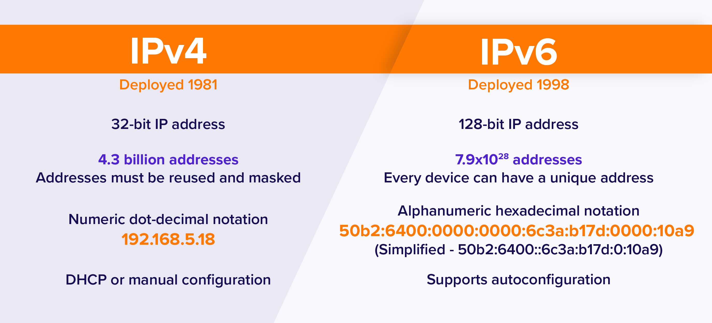
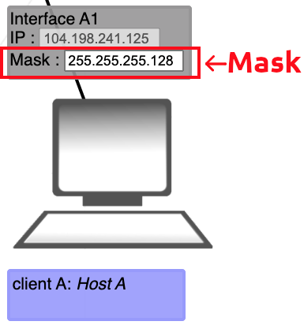
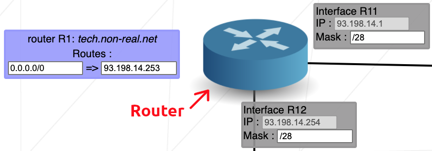
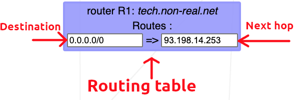

# What is a network?

- A `network` is nothing more than two or more computers connected to each other so that they can exchange information, such as e-mail messages or documents, or share resources, such as disk storage or printers. In most cases, this connection is made via electrical cables that carry the information in the form of electrical signals. But in some cases, other types of connections are used. For example, fiber-optic cables let computers communicate at extremely high speeds by using impulses of light. Wireless networks let computers communicate by using radio signals, so the computers aren’t restricted by physical cables.

## IP address:


<div align="center" width="100%">
    
</div>


- An IP (Internet Protocol) address is a unique numerical label assigned to each device connected to a computer network that uses the Internet Protocol for communication. It serves two main functions:


<div align="center" width="100%">
    
</div>

- An IPv4 address is 32 bits long.
- The address space of IPv4 is $2^{32}$ or 4,294,967,296 (more than 4 billion).

1. **Identification**: It identifies a device on a network. Each device has a unique IP address within the network, allowing it to be distinguished from other devices.

2. **Location Addressing**: It provides the location of the device in the network, which helps in routing data between devices. The IP address acts as a return address for data packets sent across the network.


<div align="center" width="100%">
    
</div>

### Notations:

1. **Dotted Decimal Notation (IPv4)**:
This is the most commonly used format for IPv4 addresses. It represents an IP address as four decimal numbers separated by dots. Each number ranges from 0 to 255.
2. **Binary Notation**:
In binary notation, an IP address is represented as a sequence of 1s and 0s. This format is used internally by computers and routers to process IP addresses.

- Example:

- IP Address: `192.168.1.1`.
- IP Address in binary: `11000000.10101000.00000001.00000001`.

### => Conversion binary to decimal:

<p align="center" width="100%">

| $2^7$ | $2^6$ | $2^5$ | $2^4$ | $2^3$ | $2^2$ | $2^1$ | $2^0$ | 
|-|-|-|-|-|-|-|-|
| 128 | 64 | 32 | 16 | 8 | 4 | 2 | 1 |

</p>

### Classes of IPv4 address:

<div align="center" width="100%">
    
    
</div>

### Public and Private IP Addresses:


- **Public IP Addresses**: These are assigned by Internet Service Providers (ISPs) and are unique across the entire internet. They are used for communication between devices on different networks.

- **Private IP Addresses**: These are used within a local network and are not routable on the internet. They are typically used for internal communication within a private network (e.g., home or office networks). Private IP ranges include addresses like `192.168.x.x`, `10.x.x.x`, and `172.16.x.x` to `172.31.x.x`.

```
    => 10.0.0.0 – 10.255.255.255     (16,777,216 IP addresses)
    => 172.16.0.0 – 172.31.255.255   (1,048,576 IP addresses)
    => 192.168.0.0 – 192.168.255.255 (65,536 IP addresses)
```

### Finding the Subnet ID:

- Finding the subnet ID is a three steps process:

1. First, we convert the IP address and the Mask to binary.
2. Then we determine the network and host portions of the address based on the mask. 1s define the network portion, and 0s define the host portion of the address.
3. We find the subnet ID in binary by changing all host bits to 0s. We find the Broadcast address in binary by changing all host bits to 1s. 
4. We convert the binary representations to decimals.

#### Example 1: 25.44.33.145/27

<div bg-color="0xffffff" align="center" width="100%">
    
</div>

#### Example 2: 172.155.2.250/18

<div bg-color="0xffffff" align="center" width="100%">
    
</div>

## What is subnetting?

- A **subnetwork**, or **subnet**, is a logical subdivision of an IP network. It segments a larger network into smaller, more manageable pieces.
- The practice of dividing a network into multiple smaller networks is called **subnetting**.
- Devices within the same subnet share the same **most-significant bit-group** (or **network portion**) of their IP address, which is determined by the subnet mask. This portion is identical for all devices within the same subnet, distinguishing it from other subnets.

### Subnetting steps:

1. `Identify the class of the IP address` and `note the default subnet mask`.

2. `Convert the default subnet mask into binary`.

3. `Note the number of hosts required per subnet` and `find the subnet Generator (SG)` and `octet position`.

4. `Generate the new subnet mask`.

5. `Use the SG and generate the network ranges (subnets) in the appropriate octet position`.

### Subnet a network based on the host requirements:

- Example: Subnet the IP address 216.21.5.0 into 30 hosts in each subnet.

1. Class C IP Address - Default Subnet Mask: 255.255.255.0 or /24

2. Default Subnet Mask into binary: 11111111.11111111.11111111.00000000

3. No. of hosts/subnets: 30 (11110) - 5 bits | SG : 32 | Octet Position: 4 => 11111111.11111111.11111111.11100000

4. New Subnet Mask: 11111111.11111111.11111111.11100000 or /27

5. Network Ranges (Subnets):

<center>

| Network Address: | Usable IP Range | Broadcast Address |
|-|-|-|
| 216.21.5.0 | 216.21.5.1 - 216.21.5.30 | 216.21.5.31 |
| 216.21.5.32 | 216.21.5.33 - 216.21.5.62 | 216.21.5.63 |
| 216.21.5.64 | 216.21.5.65 - 216.21.5.126 | 216.21.5.127 |
| 216.21.5.128 | 216.21.5.129 - 216.21.5.158 | 216.21.5.159 |
| 216.21.5.160 | 216.21.5.161 - 216.21.5.190 | 216.21.5.191 |
| 216.21.5.192 | 216.21.5.193 - 216.21.5.222 | 216.21.5.223 |
| 216.21.5.224 | 216.21.5.225 - 216.21.5.254 | 216.21.5.255 |

</center>

## Subnet Mask:

- A subnet mask is a 32-bit number used in IP networking to divide an IP address into network and host portions. It is employed in IPv4 (Internet Protocol version 4) networks to define which part of the address refers to the network and which part refers to individual hosts (computers or devices) within that network.

### Structure of a Subnet Mask:
- A subnet mask consists of two parts:

- **Network part**: The bits that correspond to the network portion of the IP address.
- **Host part**: The bits that correspond to the host portion (the individual device or interface).

- **Example of a Subnet Mask:**

```
255.255.255.0 = 11111111.11111111.11111111.00000000
```
- This means:

- The first 24 bits (the ones) identify the **network portion** of the IP address.
- The last 8 bits (the zeros) identify the **host portion** of the IP address.
- If an IP address is `192.168.1.10`, the subnet mask `255.255.255.0` would signify that:

- The **network address** is `192.168.1.0`.
The **host part** is `10`, which identifies a specific device within the network.

<div align="center" width="100%">
    
</div>


### CIDR Notation:

- Instead of writing subnet masks in the **dotted-decimal format**, it's often written using **CIDR** (**Classless Inter-Domain Routing**) **notation**, which represents the number of bits that are used for the network portion. For example, `255.255.255.0` in CIDR notation is written as `/24`, since the first 24 bits are the network part.

### Examples of Subnet Masks:
- `/8` → `255.0.0.0` (used for large networks)
- `/16` → `255.255.0.0` (medium-sized networks)
- `/24` → `255.255.255.0` (small networks)

### Role of a Subnet Mask:
1. **Network Segmentation**: It helps to segment a larger network into smaller, more manageable sub-networks (subnets), improving performance and security.
2. **Routing**: Routers use subnet masks to determine where to send data based on the destination IP address.
3. **IP Address Allocation**: By adjusting the subnet mask, you can allocate a range of IP addresses within a network.

## Swicth:

- **Switch** is a hardware device used to connect multiple devices within a local area network (LAN). It operates at the **data link layer** **(Layer 2)** of the OSI model, meaning it primarily deals with MAC addresses and forwarding data frames between devices on the same network.

<div align="center" width="100%">
    
</div>

### Key Features of a Switch:
1. **Forwarding Based on MAC Addresses**: A switch learns the MAC addresses of connected devices and uses this information to forward data frames only to the intended recipient device. This makes it more efficient than a hub, which broadcasts data to all connected devices.

2. **Full-Duplex Communication**: Switches allow for simultaneous sending and receiving of data between devices (full-duplex), reducing collisions and increasing network performance.

3. **Dedicated Bandwidth per Port**: Each device connected to a switch has its own dedicated bandwidth, meaning the network is less likely to become congested compared to older hubs.

4. **MAC Address Table**: Switches maintain a **MAC address table** (or forwarding table) to keep track of which MAC addresses are associated with which switch ports. This allows them to send data frames directly to the correct device.

### How Switches Work?
- When a switch receives a data frame:

1. It examines the **destination MAC address**.
2. It checks its MAC address table to see which port is connected to that MAC address.
3. If it finds the matching port, it forwards the frame only to that port. If it doesn't find the address, the switch broadcasts the frame to all ports (except the one from which the frame arrived).
4. As devices communicate, the switch learns the MAC addresses of devices and updates its MAC address table.


## Router:

- A **router** is a networking device that connects multiple networks and directs data between them, typically operating at **Layer 3 (Network Layer)** of the OSI model. Routers use IP addresses to determine the best path for forwarding data to its destination, whether it's within a local network (LAN) or to a remote network, such as the internet (WAN).

<div align="center" width="100%">
    
</div>

### Key Functions of a Router:

1. **Routing**: Routers use a process called routing to determine the best path for data packets to travel across interconnected networks. They maintain a **routing table** that stores information about different networks and the paths to reach them.

2. **IP Address Forwarding**: Unlike switches (which use MAC addresses), routers use **IP addresses** to forward packets to the correct destination. They inspect the packet's destination IP address and decide where to forward it.

3. **Network Segmentation**: Routers divide networks into smaller sub-networks, which helps manage traffic and improves security. Each network connected by a router operates in a separate IP address range.

4. **Packet Filtering and Security**: Many routers include firewalls and can filter traffic based on IP addresses, protocols, and ports, allowing network administrators to control incoming and outgoing traffic. This helps protect against unauthorized access and security threats.

5. **Network Address Translation (NAT)**: Routers often perform **NAT**, allowing multiple devices on a private network to share a single public IP address when connecting to the internet. NAT translates the internal IP addresses of devices into the router's external IP address and vice versa.

6. **DHCP (Dynamic Host Configuration Protocol)**: Routers can act as a **DHCP server**, assigning IP addresses automatically to devices within a local network, which simplifies IP address management.

### Switch vs. Router:

- A **switch** connects devices within the same local network and forwards data based on MAC addresses (Layer 2).
- A **router**, on the other hand, connects different networks (such as a LAN to the internet) and forwards data based on IP addresses (Layer 3).

### How Routers Work?

1. **Packet Inspection**: When a data packet arrives at a router, the router checks the **destination IP address**.
2. **Routing Table Lookup**: The router consults its routing table to determine the best route for the packet.
3. **Forwarding**: The router forwards the packet to the next router or directly to the destination device if it's in the same network.
4. **Gateway Functionality**: Routers often act as gateways between different networks, including the connection between a local network (LAN) and the internet.

### What is IP address overlaps?

- `IP address overlaps`, which occur when two or more networks or devices are `assigned IP addresses that fall within the same range or subnet`. This can create significant problems in routing, communication, and network segmentation.


### Routing Table:

- A **routing table** is a data table stored in a router or a network host that lists the routes to particular network destinations.

<div align="center" width="100%">
    
</div>

#### Structure:

- A typical routing table contains the following fields:
1. **Destination Network**: The network address of the destination where the data packet should be sent. This is often expressed as an IP address and subnet mask (e.g., `192.168.1.0/24`).

2. **Subnet Mask**: Defines the network portion and the host portion of the IP address. It helps in determining which part of the IP address represents the network and which part represents the host.

3. **Next Hop**: The IP address of the next router or gateway that should receive the packet on the way to the destination. It specifies where the packet should be forwarded next.

4. **Interface**: The network interface (such as Ethernet or Wi-Fi) through which the packet should be sent.

5. **Metric**: A value used to determine the cost of using a route. Lower metrics typically represent preferred routes. Metrics can be based on various factors such as hop count, bandwidth, delay, or reliability.

6. **Route Type**: Indicates whether the route is static (manually configured by an administrator) or dynamic (learned through routing protocols like OSPF, BGP, or EIGRP).

#### Types of Routes:
- **Static Routes**: Manually configured by network administrators. These routes do not change unless manually updated.

- **Dynamic Routes**: Learned through routing protocols. These routes are updated automatically as the network topology changes.

#### 5. How It Works?

- When a data packet arrives at a router, the router examines the destination IP address and looks up the routing table to find the most appropriate route. It then forwards the packet to the next hop specified in the table, which could be another router or the final destination.

####  Example:

<center>

| Destination |	Subnet Mask |	Next Hop |	Interface |	Metric |
|-------------|-------------|------------|------------|--------|
| 192.168.1.0 |	255.255.255.0 |	192.168.1.1 |	eth0 |	1 |
| 10.0.0.0 |	255.0.0.0 |	10.0.0.1 |	eth1 |	10 |
| 0.0.0.0 |	0.0.0.0 |	192.168.0.1 |	eth0 |	20 |

</center>

- **Destination**: `192.168.1.0/24` is reachable through `eth0` with a metric of 1.
- **Destination**: `10.0.0.0/8` is reachable through `eth1` with a metric of 10.
- **Default Route (0.0.0.0/0)**: Used when no specific route matches, forwarded to `192.168.0.1` via `eth0` with a metric of 20.