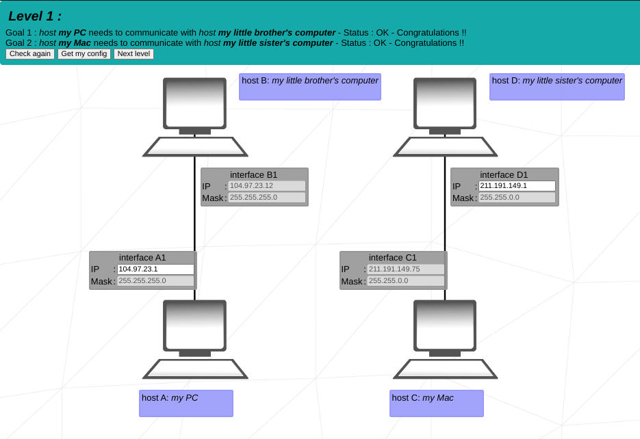
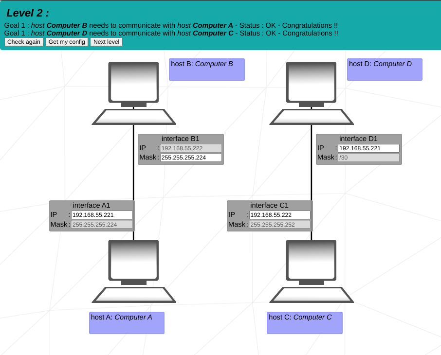
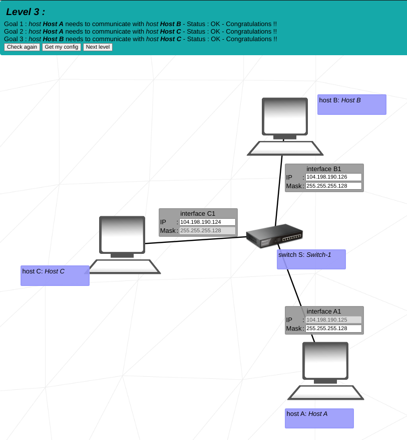
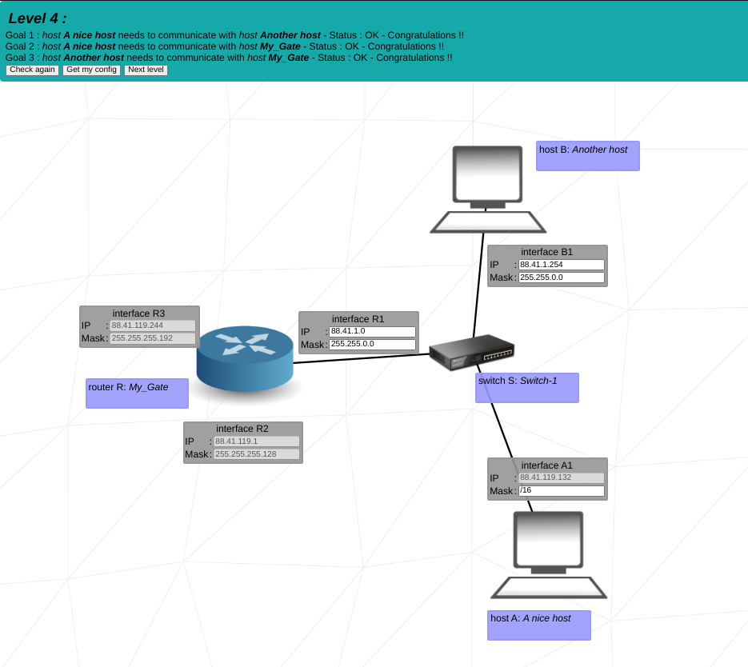
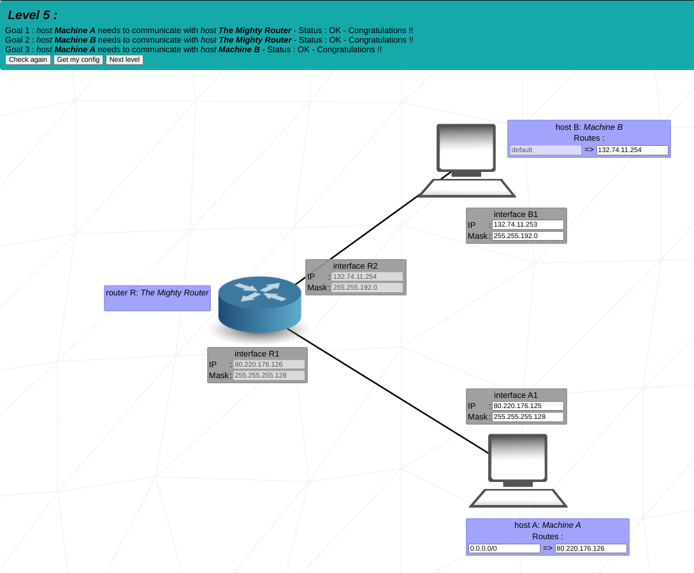
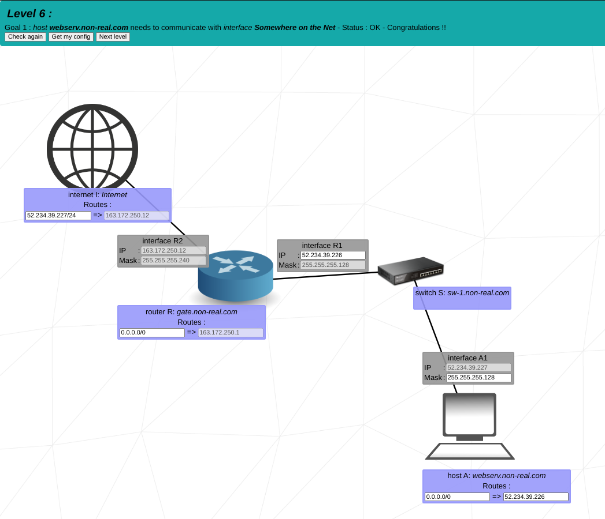
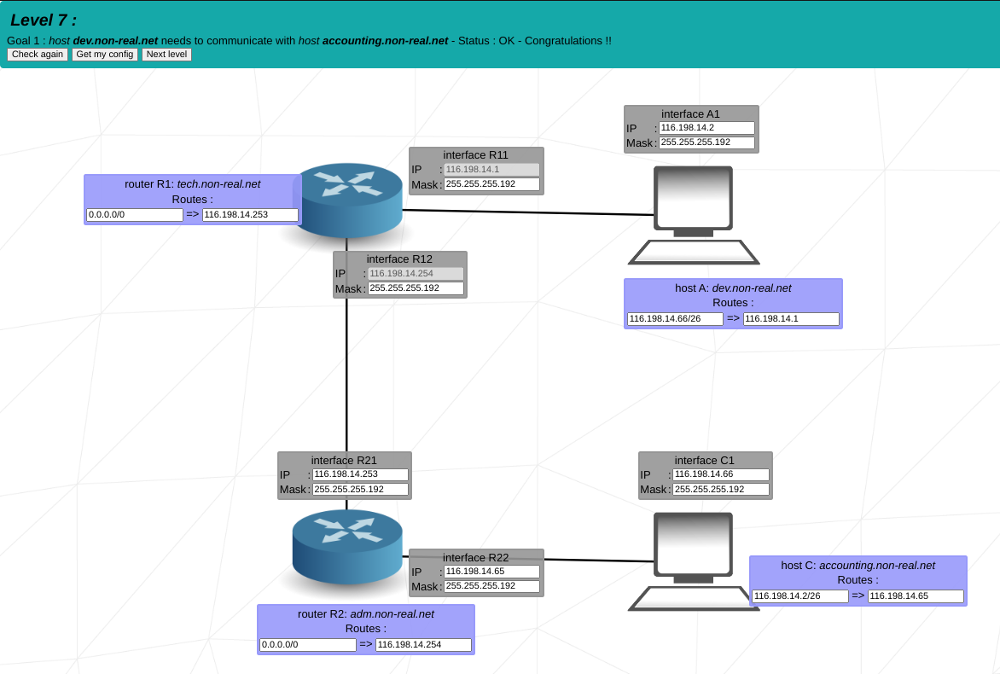
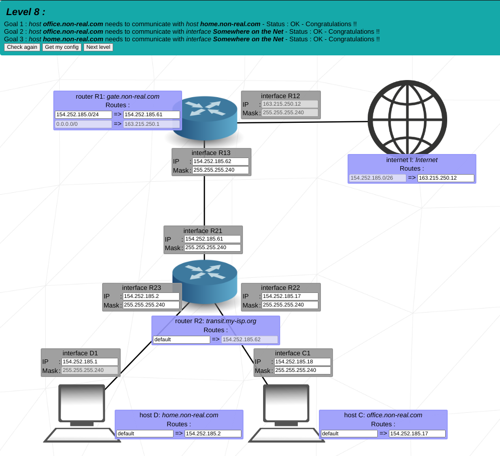
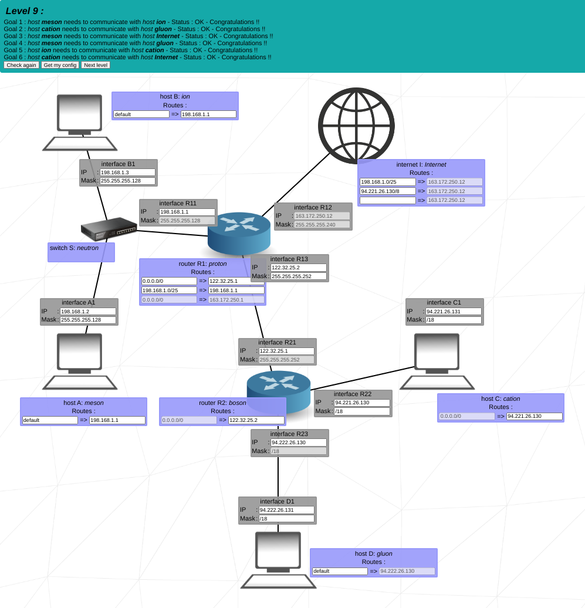
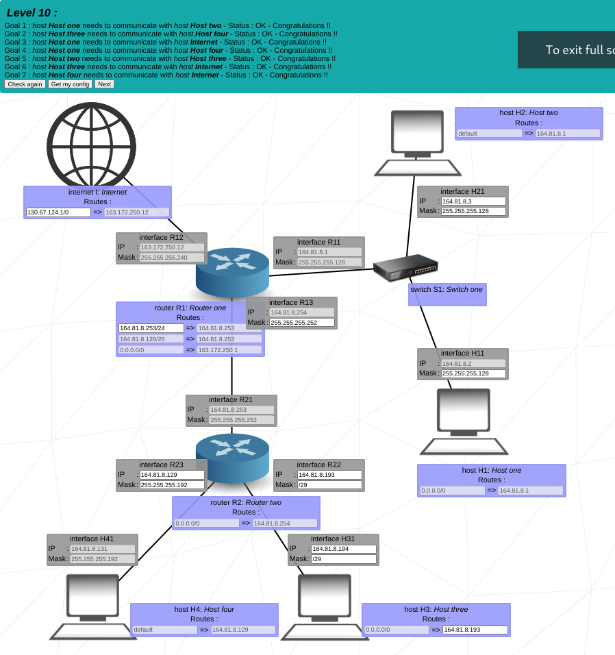

# NetPractice

This project is a general practical exercise to let you discover networking.

    

    
Level 1

    
    

    
Level 2

    
     
    
Level 3

    
    

    
Level 4

    
    

    
Level 5

    
    

    
Level 6

    
    

    
Level 7

    
    

    
Level 8

    
    

    
Level 9

    
    

    
Level 10

    

### Resources

- https://www.computernetworkingnotes.com/ccna-study-guide/introduction-to-subnetting.html
- https://www.softwaretestinghelp.com/computer-networking-basics/
- https://www.networkacademy.io/ccna/ip-subnetting/finding-the-subnet-id
- https://www.jntua.ac.in/gate-online-classes/registration/downloads/material/a158978210424.pdf
- https://www.geeksforgeeks.org/tcp-ip-model/
- https://www.youtube.com/playlist?list=PLBlnK6fEyqRi7E6_6rLC5N_v50TW6qlrf
- https://github.com/lpaube/NetPractice
- https://www.youtube.com/watch?v=YJGGYKAV4pA
