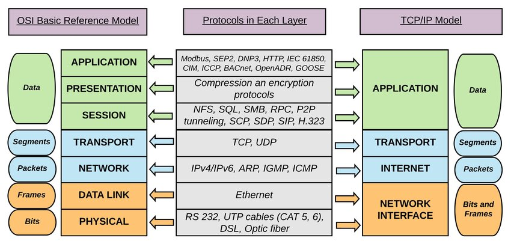

# TCP/IP and OSI Models

## Introduction

The **TCP/IP model** and the **OSI model** are both reference models used to understand and describe how different networking protocols interact. While the OSI model is conceptual and more detailed, the TCP/IP model is used in practice for actual network communication, especially for the internet.

---

## OSI Model

The **OSI (Open Systems Interconnection) model** is a conceptual framework that defines seven layers, each responsible for specific tasks related to network communication.

### OSI Layers:

1. **Physical Layer (Layer 1)**:
   - Responsible for transmitting raw bits over the physical medium (cables, wireless).
   - Deals with hardware aspects like voltage levels, data rates, and physical connections.

2. **Data Link Layer (Layer 2)**:
   - Provides node-to-node data transfer and error detection.
   - Ensures reliable communication between devices on the same network segment.
   - Protocols: Ethernet, PPP (Point-to-Point Protocol), ARP (Address Resolution Protocol).

3. **Network Layer (Layer 3)**:
   - Handles logical addressing, routing, and packet forwarding across networks.
   - Responsible for determining the best path for data to travel from source to destination.
   - Protocols: IP (Internet Protocol), ICMP (Internet Control Message Protocol), routing protocols like OSPF, BGP.

4. **Transport Layer (Layer 4)**:
   - Ensures reliable end-to-end communication between systems.
   - Provides error recovery and flow control.
   - Protocols: TCP (Transmission Control Protocol), UDP (User Datagram Protocol).

5. **Session Layer (Layer 5)**:
   - Manages sessions (connections) between applications.
   - Responsible for maintaining, establishing, and terminating communication sessions.
   - Protocols: NetBIOS, RPC (Remote Procedure Call).

6. **Presentation Layer (Layer 6)**:
   - Responsible for data translation, encryption, and compression.
   - Ensures data is in a readable format for the application layer.
   - Protocols: SSL/TLS, JPEG, GIF.

7. **Application Layer (Layer 7)**:
   - The top layer that interacts directly with end-user applications.
   - Provides application-level protocols and services like email, file transfer, and network management.
   - Protocols: HTTP, FTP, SMTP, DNS, POP3.

---

## TCP/IP Model

The **TCP/IP model** is a more practical model, focusing on the communication protocols used in the internet. It uses four layers to represent the different aspects of network communication.

### TCP/IP Layers:

1. **Network Interface Layer** (corresponds to OSI's Physical and Data Link Layers):
   - Responsible for defining how data is physically transmitted over a network.
   - Deals with the hardware addressing, access, and medium type.
   - Examples: Ethernet, Wi-Fi.

2. **Internet Layer** (corresponds to OSI's Network Layer):
   - Responsible for logical addressing, routing, and packet forwarding.
   - Defines the packet structure (IP datagrams) and how data travels across the internet.
   - Protocols: IP (Internet Protocol), ICMP, ARP.

3. **Transport Layer** (same as OSI's Transport Layer):
   - Ensures reliable data transfer between systems.
   - Provides error correction, flow control, and sequencing.
   - Protocols: TCP, UDP.

4. **Application Layer** (corresponds to OSI's Session, Presentation, and Application Layers):
   - Defines the protocols for end-user communication.
   - Enables applications to interact with the network.
   - Protocols: HTTP, FTP, SMTP, DNS, Telnet.

---

## Comparison of OSI and TCP/IP Models

| **Feature**                | **OSI Model**                   | **TCP/IP Model**              |
|----------------------------|----------------------------------|------------------------------|
| **Number of Layers**        | 7                                | 4                            |
| **Layered Approach**        | More detailed and abstract       | More practical and concise   |
| **Protocol Independence**   | Protocol-independent, conceptual | Protocol-dependent           |
| **Usage**                   | Primarily educational and theoretical | Used in real-world networking |
| **Focus**                   | Detailed functionality per layer | End-to-end communication and routing |

---

## Conclusion

The OSI model is more theoretical and used for understanding the different functions in networking, while the TCP/IP model is a more practical representation of how modern networks (especially the internet) operate. Understanding both models is important for designing, managing, and troubleshooting networks.
 

    

---